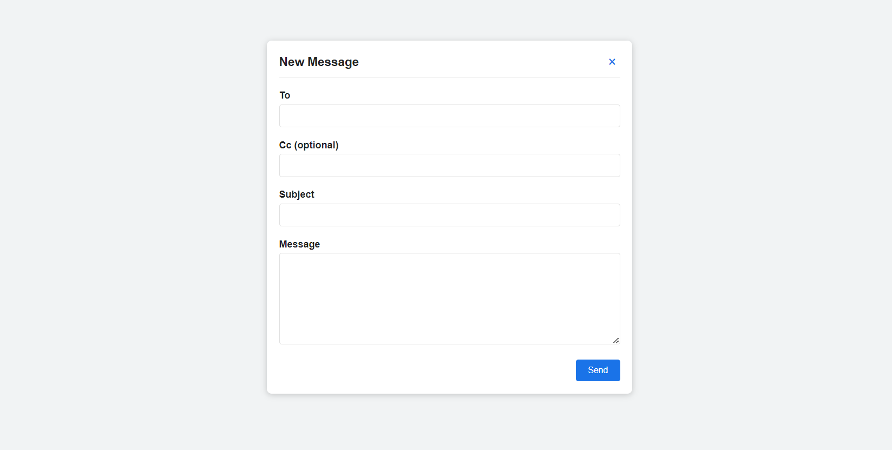

# php_form

This project provides a simple web interface to compose and send emails using PHP and PHPMailer.

## Features

- Compose new email messages
- Specify recipients in the "To" field
- Optionally add "Cc" recipients
- Input a subject for the email
- Write the email body in a text area
- Error messages are displayed for invalid email addresses

## Requirements

- PHP 7.0 or higher
- PHPMailer
- A Gmail account with an App Password

## Installation

Follow these instructions to get the project up and running on your local machine using XAMPP.

### Prerequisites

- [XAMPP](https://www.apachefriends.org/index.html): Make sure XAMPP is installed on your computer.

### Installation

1. **Download:** Download the project files from [GitHub](https://github.com/Akash-Saji/php_form.git).
2. **Extract:** Extract the files to a folder on your computer.
3. **Move:** Move the extracted folder into the `htdocs` directory of your XAMPP installation. The `htdocs` directory is typically located at `C:\xampp\htdocs` on Windows or `/Applications/XAMPP/htdocs` on macOS.

### Running the Application

1. **Start XAMPP:** Open the XAMPP Control Panel and start the Apache and MySQL services.
2. **Access in Browser:** Open your web browser and navigate to `http://localhost/php_form/index.php`.
3. **Register:**  Fill out the Gmail username and Gmail password. Without these, the email sending functionality will not work.
4. **Check Email:** Check the email inbox of the provided email address for the registration details and PDF attachment.

## Troubleshooting

- If you encounter any issues, ensure that XAMPP is running properly and that the project files are located in the `htdocs` directory.
- Check the Apache error logs (`xampp/apache/logs/error.log`) for any error messages that may provide clues to the problem.

## Built With

- [PHP](https://www.php.net/) - Backend scripting language.
- [XAMPP](https://www.apachefriends.org/index.html) - Development environment.
- [SMTP Server](https://example.com/smtp-server) - SMTP server for sending emails.

## Screenshot

